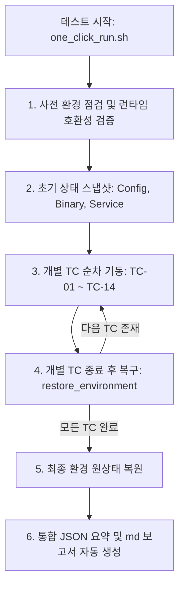

# EDR-X EDR 방어적 보안성 검증 계획서 (Defensive Validation Plan)

본 문서는 격리된 랩 환경(Colima x86_64 가상 머신)에서 **EDR-X EDR Agent**의 탐지 한계, 가시성 갭, 무결성 제어를 방어적인 관점에서 검증하기 위한 상세 테스트 계획 및 체계를 정리한 문서입니다. 

기존 Cybereason PoC 검증 프레임워크의 구조를 계승하고, 제공된 `Federico B` 연구 보고서(`edr-x_edr_bypass_llm_handoff.md`)의 7개 도메인 탐지 우회 시나리오를 바탕으로 구성되었습니다.

---

## 1. 개요 및 목적
1. **가시성 및 탐지 커버리지 분석**: EDR-X EDR이 각 단계별(Pre-Execution, Initial Access, Dynamic Runtime 등) 위협 행위를 탐지하고, SOC에서 추적할 수 있는 텔레메트리 검색 기능를 충실히 제공하는지 점검합니다.
2. **에이전트 무결성(Anti-Tampering) 검증**: 로컬 시스템의 침해 상태(Post-Compromise)를 가정하여, EDR 센서 자체에 대한 비인가 프로세스의 정지, 파일 삭제, 설정 임의 변경에 대응하는 저항력을 평가합니다.
3. **권한 제어 경계선 검증**: 권한이 없는 일반 사용자 계정(Non-Root)에서 에이전트의 제어면(IPC Unix Socket 등)에 비인가 데이터 주입이 가능한지 및 특권 무력화가 가능한지 검증합니다.
4. **SaaS 연동성 테스트**: 에이전트 연동 토큰과 SaaS 콘솔(`<EDR_SAAS_CONSOLE>`) 간의 정상 이벤트 전송 및 지연 시간(Latency)을 측정합니다.

---

## 2. 출처 분석 및 데이터 갭 (Data Gaps)
연구 보고서(`edr-x_edr_bypass_llm_handoff.md`)에 근거하여 테스트 계획을 수립할 때 다음의 불일치 및 제약 사항을 사전에 명시합니다.

* **수치적 불일치**: 공개 요약서상 총 우회 건수는 **57개**로 표기되어 있으나, 제공된 Coverage Map 상의 7개 도메인별 기재 건수의 합은 **47개**입니다. 
* **구체적 PoC의 부재**: 해당 문건은 고수준 카테고리(Category-level)만 언급하고 있으며, 악성 페이로드나 공격 명령어 체인은 보안상 생략되어 있습니다. 
* **실무적 접근**: 본 계획서는 실제 우회 기법의 기계적 재현이 아니라, **"각 도메인별 EDR의 가시성 갭을 방어적으로 매핑하고 로깅을 강화"**하는 목적에 집중합니다.

---

## 3. 테스트 환경 구성
테스트 환경은 macOS Apple Silicon의 호스트 커널 간섭을 완전히 분리하고, 에이전트(amd64)와의 완벽한 아키텍처 호환성을 보장하기 위해 다음과 같이 수립합니다.

* **인프라**: macOS + Colima 가상 머신 (`vz/qemu` 에뮬레이션)
* **VM 사양**: Ubuntu 24.04 LTS (`x86_64` 아키텍처 강제 활성화)
* **네트워크**: 외부 아웃바운드 허용 (SaaS 연동 및 API 텔레메트리 전송 목적)
* **안전 원칙(Safe Lab Principles)**:
  * 실제 악성코드나 C2 백도어는 일절 사용하지 않습니다.
  * 모든 프로세스/네트워크 행위는 추적이 용이하도록 고유 마커(Marker: `EDR_POC_TC*_timestamp`)가 주입된 Benign Simulation 파일/스크립트만 사용합니다.

---

## 4. 도메인별 상세 검증 시나리오 (14개 Test Cases)

기존 Cybereason PoC 프레임워크의 실행 설계(TC-01 ~ TC-14)를 EDR-X의 아키텍처 및 7대 역량 도메인에 매핑하여 설계합니다.

### [그룹 A] 고권한 침해 가정 시나리오 (Post-Compromise / Root 권한)

#### TC-01: Detection Telemetry (기본 텔레메트리 연동)
* **검증 목적**: 초기 침해 흔적을 SaaS 콘솔에서 추적할 수 있는 최소 관측 데이터가 실시간 확보되는가?
* **테스트 내용**: 3단계 프로세스 체인(`bash -> sh -> python3`) 실행, 외부 도메인(`example.com`) 대상 HTTP 아웃바운드 및 DNS 조회, 기본 시스템 정찰 명령어 실행.
* **통과 기준**: EDR-X 관리 콘솔 또는 텔레메트리 검색 쿼리를 통해 해당 `EDR_POC_TC01_*` 마커 프로세스 및 네트워크 연계 이벤트가 5분 이내 검색되어야 함.

#### TC-02: TLS Verification & Trust Abuse (서명 및 인증서 검증)
* **검증 목적**: 에이전트 통신 신뢰 체인(인증서/루트 신뢰) 오염 시 오작동 여부.
* **테스트 내용**: `/etc/ssl/certs` 또는 에이전트 소유의 신뢰 인증서 경로 수정 권한 검사. 위조 인증서 대체를 통한 통신 가로채기(MITM) 감지 확인.
* **통과 기준**: 비인가 인증서 변조 시 즉시 에이전트에서 무결성 경고가 발생하거나 통신이 전면 차단되어야 함.

#### TC-03: Configuration Manipulation (설정 변경 시도)
* **검증 목적**: EDR 설정값을 무단 변경하여 탐지 정책 우회 혹은 비활성화가 가능한가?
* **테스트 내용**: `/etc/edr-x` 하위 설정 파일(JSON 또는 config 바이너리 제어)에 직접 쓰기 시도. `edrctl`에 토큰 변경이나 백업/복원 무력화 명령어(비인가) 전달 시도.
* **통과 기준**: Root 권한이라 하더라도 파일시스템 보호 정책에 의해 설정 파일 쓰기가 거부되거나 변조 감지 즉시 얼럿이 생성되어야 함.

#### TC-04: Anti-Tamper & Service Lifecycle (안티-탬퍼 저항성)
* **검증 목적**: 공격자가 센서 프로세스를 강제 종료하거나 삭제하여 탐지 체계를 무력화할 수 있는가?
* **테스트 내용**: `edrctl control stop` (보호 패스워드 미지정 시), `kill -9`을 통한 에이전트 프로세스 강제 종료 시도, 에이전트 핵심 바이너리(`/opt/edr-x/bin/*`)의 이름 변경 및 삭제 시도.
* **통과 기준**: 프로세스 종료 즉시 Watchdog에 의해 즉시 복구되거나, 핵심 파일에 대한 삭제/이름변경 행위 자체가 커널 레벨에서 차단되어야 함.

#### TC-05: Symlink/TOCTOU Race (경로 바인딩 확인)
* **검증 목적**: 경로 기반 처리 시 Symlink 변경을 통해 비인가 쓰기 권한이 승격되거나 우회되는가?
* **테스트 내용**: 에이전트가 쓰는 로그 경로, 설정 경로를 민감한 시스템 경로(예: `/etc/shadow`)로 심볼릭 링크 처리한 뒤 에이전트의 I/O 동작을 유도.
* **통과 기준**: 링크 추적 정책(O_NOFOLLOW)에 의해 심볼릭 링크 접근이 거부되어야 함.

#### TC-06: Unix Domain Socket IPC Analysis (IPC 제어면 통제)
* **검증 목적**: 에이전트 통신용 로컬 Unix 도메인 소켓의 권한 설정과 제어 채널의 무결성 검증.
* **테스트 내용**: `/var/run/` 내부의 EDR-X 소켓 파일 권한 분석 및 비인가 프로세스의 소켓 연결 패킷 송신 시도.
* **통과 기준**: Peer Credential(UID/GID 검증)에 의해 비인가 로컬 연결이 즉시 거절되어야 함.

#### TC-07: Low-Level Kernel Telemetry (eBPF / io_uring / Direct Syscall)
* **검증 목적**: 일반 훅(Hooking)을 우회하는 저수준 시스템 호출에 대한 가시성 보유 여부.
* **테스트 내용**: `io_uring` 시스템 콜을 통한 파일 생성 및 I/O 수행, 비인가 eBPF 프로그램 로드 시도, 직접 어셈블리(Direct Syscall)를 통한 파일/네트워크 동작 생성.
* **통과 기준**: SaaS 콘솔 혹은 에이전트 자체 감사 로그에 해당 커널 이벤트에 대한 telemetry 흔적이 누락 없이 기록되어야 함.

#### TC-08: Short-Lived Process Burst (단명 프로세스 수집 갭)
* **검증 목적**: 초단위(ms) 대량 프로세스 버스트 생성 시 텔레메트리 누락 혹은 드롭이 발생하는가?
* **테스트 내용**: 1초 이내에 200개 이상의 독립적인 단명(Short-lived) 헬퍼 프로세스 연속 기동 및 종료.
* **통과 기준**: 생성된 마커 개수 대비 95% 이상의 이벤트가 콘솔에 드롭 없이 조회되어야 함.

#### TC-09: Package Manipulation & Supply Chain (설치 체인 검증)
* **검증 목적**: 에이전트 배포 파일의 입력값 정규화 약화로 인한 주입 벡터 방지 여부.
* **테스트 내용**: 압축 해제(Decompress) 시 리소스 고갈 방지 통제(Max Length) 체크 및 토큰 입력 시 개행/특수문자를 통한 Config Injection 가능성 점검.
* **통과 기준**: 입력값 정규화 정책 및 안전한 Parser 라이브러리에 의해 비정상 페이로드가 정밀 필터링되어야 함.

---

### [그룹 B] 저권한 사용자 가시성 시나리오 (Non-Root 계정 / `crtester`)

#### TC-10: Non-Root Permission Boundary (일반 사용자 권한 경계)
* **검증 목적**: 일반 사용자 권한에서 EDR 핵심 경로에 쓰기 및 수정 시도가 정상 차단되는가?
* **테스트 내용**: 저권한 계정(`crtester`)으로 로그인 후 `/opt/edr-x/etc`, `/opt/edr-x/bin` 경로에 파일 생성 및 쓰기 파일 디스크립터(O_WRONLY) 오픈 시도.
* **통과 기준**: DAC(Owner/Permissions) 권한 오류로 원천 차단되어야 함.

#### TC-11: Non-Root Process Control (비특권 프로세스 통제)
* **검증 목적**: 일반 사용자 권한에서 EDR 프로세스 가용성에 영향을 줄 수 있는가?
* **테스트 내용**: 저권한 계정에서 EDR 핵심 PID에 대한 `kill` 및 `SIGTERM` 신호 전달 시도.
* **통과 기준**: `Permission Denied`로 신호 전달이 원천 거부되어야 함.

#### TC-12: Non-Root IPC Access (비특권 IPC 차단)
* **검증 목적**: 일반 사용자 권한에서 EDR 내부 IPC 엔드포인트에 임의 접근 가능한가?
* **테스트 내용**: 저권한 계정에서 EDR-X Unix 소켓 파일 연결 시도 및 임의 명령 인젝션.
* **통과 기준**: 연결 권한 거부 및 소켓 디렉토리 접근 차단 상태가 확인되어야 함.

#### TC-13: Non-Root User Persistence (일반 사용자 영역 지속성 탐지)
* **검증 목적**: 일반 사용자 영역에서 장기 은닉 목적으로 생성되는 지속성 경로 감지 여부.
* **테스트 내용**: `crtester` 홈 디렉토리의 `.bashrc`, `.config/autostart/` 하위에 자동 실행 스크립트 등록 및 사용자 `crontab` 등록 시도.
* **통과 기준**: 해당 로컬 경로의 쓰기 행위가 EDR 경보 또는 telemetry 상에 탐지되어야 함.

#### TC-14: Non-Root Privileged Bypass (비특권 우회 명령 차단)
* **검증 목적**: 일반 사용자 계정에서 EDR 탐지 룰에 부하를 주거나 우회할 수 있는 특권 명령어 실행 차단 여부.
* **테스트 내용**: 저권한 계정에서 `mount`, `iptables`, `bpftool`, `tcpdump`, `auditctl` 기동 시도.
* **통과 기준**: 커널 레벨 특권 분리(Capabilites) 및 시스템 권한 거부(Permission denied)로 인해 실행이 원천 차단되어야 함.

---

## 5. 실행 절차 및 자동 복구 (Automation Frame)

과거 Cybereason POC 프레임워크의 성공 요인이었던 **"테스트 간 상태 전이 방지(State Containment)"**를 구현하기 위해 다음과 같이 실행 절차를 구조화합니다.



---

## 6. 테스트 수행 및 수동 확인 가이드

1. **에이전트 패키지 설치**:
   Colima VM 내부 환경은 Ubuntu이므로 압축 해제된 경로의 `.deb` 패키지를 사용합니다.
   ```bash
   colima ssh -- sudo dpkg -i <REPO_ROOT>/agent_install/edr-agent_extracted/edr-agent.deb
   ```
2. **매니지먼트 토큰 주입**:
   제공된 SaaS 콘솔 연동 토큰을 지정하여 활성화합니다.
   ```bash
   colima ssh -- sudo /opt/edr-x/edrctl management token set <BASE64_REG_TOKEN_FROM_ENV>
   ```
3. **에이전트 가동**:
   ```bash
   colima ssh -- sudo /opt/edr-x/edrctl control start
   ```
4. **SaaS 콘솔 탐지 상태 교차 확인**:
   각 시나리오 기동 이후, 로그에 기록된 마커(예: `EDR_POC_TC01_1773785543`) 정보를 복사하여 EDR-X SaaS 콘솔(`https://<EDR_SAAS_CONSOLE>`)의 **텔레메트리 검색** 메뉴에서 검색해 텔레메트리 가시성 일치 여부를 평가하고 결과 매트릭스를 갱신합니다.
